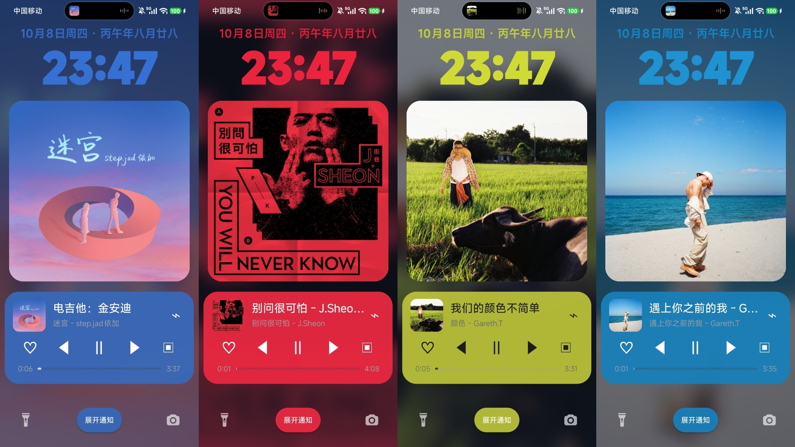
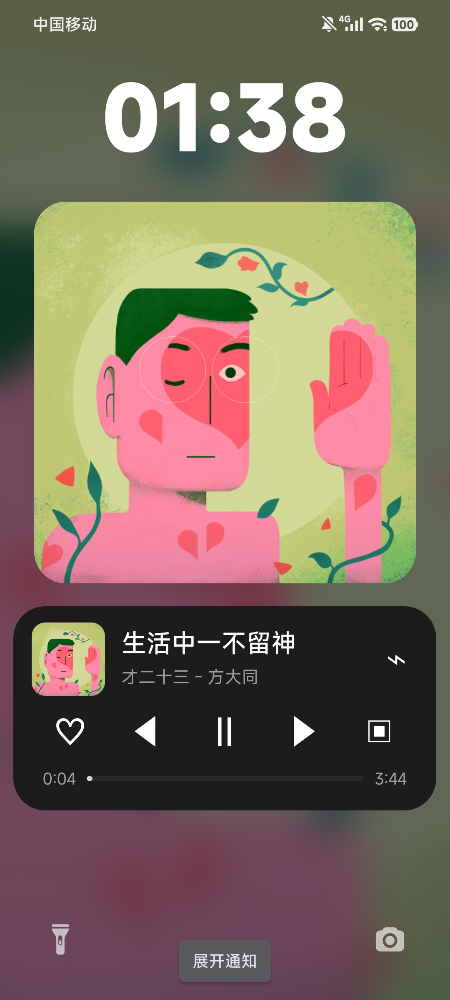
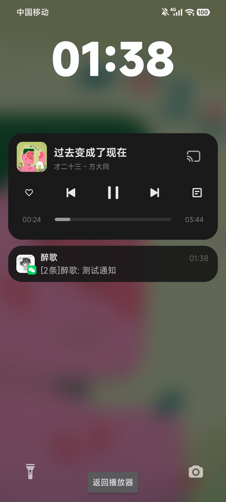
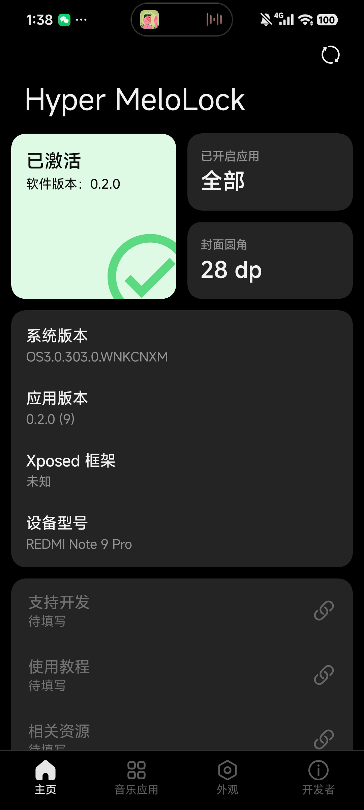
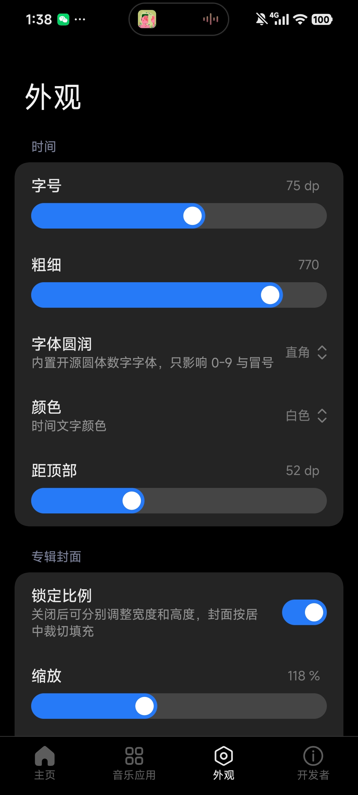

<div align="center">


# Hyper MeloLock

**为澎湃 OS 3 打造的锁屏沉浸式音乐覆盖层模块**

[](https://github.com/zuige66/Hyper-MeloLock/releases)

[](LICENSE)
[](https://android.com)
[](https://github.com/LSPosed/LSPosed)
[](https://hyperos.mi.com)
[](https://kotlinlang.org)

</div>

---

独立的 Android Vector / LSPosed 模块：给系统界面注入一个锁屏视图适配器，并把专辑封面铺成真正的锁屏壁纸。媒体发现、封面与播放控制全部走系统标准接口。**不修改任何播放器**，也不改系统 APK、壁纸或通知数据。默认关闭、失败关闭：找不到锁屏视图或媒体无效时立刻恢复原生锁屏。

## ✨ 功能介绍

<table>
<tr>
<td width="50%">

### 🎵 锁屏沉浸播放器

锁屏上换成大号时间、封面模糊背景与完整播放控制条。暂停时保留最后一帧而不是撤掉覆盖层，会话真的消失才回退原生锁屏。

</td>
<td width="50%">

### 🎨 逐项调参

时间的字号、粗细、圆润、颜色、上间距，封面的缩放与圆角，播放器卡片的圆角、上间距与底色，全都能在外观页里实时调，改完写进模块自己的配置（各组件的「上间距」统一表示离上一个组件的距离，0 就是紧贴，最上面的组件即距屏幕顶部）。时钟上方还可以显示「公历 + 周几 + 农历」日期行和自定义签名行，各自独立开关，字号、粗细、颜色都能调。每个可选颜色的项都支持「跟随专辑封面」取色，并可单独选择取色风格：低饱和磨砂（M3E）或鲜艳原色。

</td>
</tr>
<tr>
<td width="50%">

### 🔔 共享元素切换

点「展开通知」时播放器卡片沿着计算好的位移滑走、通知列表同向淡入，看起来像同一个组件在两个位置之间移动；返回时反向重演。

</td>
<td width="50%">

### 🔄 切歌不掉原生锁屏

换歌时播放器有约 300 ms 只留 URI、拿不到封面的空窗期。模块在这段时间保留上一帧，会话短暂消失还留 1.5 秒宽限期，所以换歌全程不会闪回原生锁屏。

</td>
</tr>
<tr>
<td width="50%">

### ⚡ 亮屏秒显

解锁时只把视图淡出并保留实例，熄屏期间提前把场景建好，亮屏第一帧直接复用——不重建、不闪原生锁屏。

</td>
<td width="50%">

### 🚫 锁屏禁用左下拉

沉浸场景显示期间吃掉左半屏的下拉手势，避免自绘层和原生通知面板叠在一起。右侧控制中心和指纹解锁不受影响。

</td>
</tr>
<tr>
<td width="50%">

### 👆 点封面直达音乐 App

锁屏播放器卡片上的小专辑封面可以点：轻点即解锁并直接打开当前正在播放的音乐应用（与系统点通知进 App 的路径一致）。底色支持 7 档（含跟随封面动态取色），浅色档文字自动换深色。设置了锁屏密码的设备上，该手势暂不生效。

</td>
<td width="50%">

### 🖼️ 封面壁纸化

专辑封面会被当作**真正的壁纸**铺上去，而不只是在锁屏上叠一层。系统的液态玻璃时钟与通知卡毛玻璃因此能真正取到专辑的颜色，解锁时也不会再有「早了露原生壁纸、晚了挡桌面动效」的别扭。

</td>
</tr>
<tr>
<td width="50%">

### ⚙️ 改参数即时生效

外观页里改完字号、颜色、间距、底色，回到锁屏就是新的，不需要重启 SystemUI、不需要灭屏亮屏、也不需要关掉再重新打开模块。

</td>
<td width="50%">

### 🔍 内置检查更新

「关于」页可以直接查更新：优先读 GitHub Releases，拉不到时自动回退国内静态源，国内网络也能正常拿到新版本提示。

</td>
</tr>
</table>

---

## 📸 效果预览

<p align="center">

<br/><b>多配色锁屏</b>
<br/>时间颜色可跟随专辑封面自动取色
</p>

<table>
<tr>
<td align="center" width="50%">

<br/><b>锁屏播放器</b>
<br/>时间 · 封面 · 控制条 · 底部通知入口
</td>
<td align="center" width="50%">

<br/><b>展开通知</b>
<br/>播放器卡片滑出，通知同向淡入
</td>
</tr>
<tr>
<td align="center" width="50%">

<br/><b>配置端首页</b>
<br/>开关状态卡 · 已开启应用 · 系统信息
</td>
<td align="center" width="50%">

<br/><b>外观</b>
<br/>时间 / 封面 / 播放器逐项调参
</td>
</tr>
</table>

---

## 📱 适配情况

> ⚠️ 模块按**精确构建指纹**门禁，只在下表这套环境上验证过，换机型或换 ROM 版本不会生效。

| 项目 | 要求 |
| --- | --- |
| 系统 | 澎湃 OS 3（HyperOS 3），Android 16 / API 36 |
| 设备 | Redmi Note 9 Pro（`M2007J17C` / `gauguinpro`） |
| 框架 | Vector / LSPosed，作用域**勾两项**：`com.android.systemui` 与 `com.miui.miwallpaper` |
| 播放器 | 任何提供标准 `MediaSession` 的音乐应用 |

---

## 🚀 安装

1. 到 [Releases](https://github.com/zuige66/Hyper-MeloLock/releases) 下载最新 APK 安装（正式签名，可直接覆盖升级）；最新版直链：[Hyper-MeloLock-v0.3.1.apk](https://github.com/zuige66/Hyper-MeloLock/releases/download/v0.3.1/Hyper-MeloLock-v0.3.1.apk)。
2. 在 Vector 中启用本模块，**作用域勾这两项**，缺一项对应功能就不生效：
   - `com.android.systemui` —— 锁屏覆盖层本体，**必须**
   - `com.miui.miwallpaper` —— 封面壁纸化（不勾则仍是「在 SystemUI 里叠一层」的旧效果）
3. 重启设备（或分别重启这两个进程）。
4. 打开应用，点首页状态卡开启模块开关。
5. 在「应用」页**勾选你的音乐播放器**（默认一个都不勾，必须手动选，没勾锁屏不会接管）。
6. 播放带封面的歌曲，熄屏再点亮即可看到沉浸锁屏。

> 📌 **装完 APK、或改动作用域后，需要重启手机**才会加载新代码。管理器里勾上作用域只是「声明」，
> 进程没重启就注入不进去。（开发时也可以只重启 SystemUI，用首页右上角的「重启作用域」按钮。）
>
> 📌 **改外观参数不需要重启**：v0.3.1 起配置变更会被即时感知，回锁屏就是新外观。

---

## 🔨 构建

确保已安装 JDK 21 和 Android SDK 36，然后运行：

```bash
./gradlew.bat :app:assembleDebug      # 调试包：app/build/outputs/apk/debug/app-debug.apk
./gradlew.bat :app:assembleRelease    # 发布包：app/build/outputs/apk/release/app-release.apk
```

Release 使用仓库根的 `melolock-release.keystore` 签名，口令放在 `keystore.properties`（**两者都在 `.gitignore` 里，绝不进仓库**）。没有该文件时 release 会回退到 debug 签名，可以正常构建，但那样的包不能发布。校验签名用：

```bash
apksigner verify --print-certs -v app/build/outputs/apk/release/app-release.apk
```

---

## ⚠️ 已知限制

- 只对上表的精确构建指纹生效，其他机型会主动放弃覆盖、保持原生锁屏。
- 封面壁纸化依赖 `com.miui.miwallpaper` 作用域，且必须重启过一次手机才生效；没勾或没重启时封面仍会正常显示，只是系统那些毛玻璃效果取不到专辑色，其余功能不受影响。
- 沉浸场景显示期间，**从屏幕左半边起始的上滑解锁会失效**，用右半边上滑、指纹或电源键解锁正常。
- 「Xposed 框架」一行在 legacy 模块下固定显示「未知」，这是读取方式的限制，不是故障。
- 配置端的联系方式 / 支持开发 / 使用教程 / 相关资源四项仍是占位状态。

---

## 📖 文档

- **[开发文档](docs/DEVELOPMENT.md)** — 实现细节、SystemUI 侧机制、排查手册与完整变更日志
- **[酷安发布文案](docs/COOLAPK-v0.3.1.md)** — v0.3.1 的对外介绍与更新说明（含发布前检查项）
- **[AGENTS.md](AGENTS.md)** — 面向 AI 协作者的工程约定与铁律

---

## Star History

<a href="https://star-history.dera.page/#zuige66/Hyper-MeloLock&type=date&legend=top-left">
 <picture>
   <source media="(prefers-color-scheme: dark)" srcset="https://star-history.dera.page/svg?repos=zuige66/Hyper-MeloLock&type=date&theme=dark&legend=top-left" />
   <source media="(prefers-color-scheme: light)" srcset="https://star-history.dera.page/svg?repos=zuige66/Hyper-MeloLock&type=date&legend=top-left" />
   
 </picture>
</a>

---

## 📄 许可证

本项目基于 [AGPL-3.0](LICENSE) 开源。配置端界面迁入并使用 [HyperIsland](https://github.com/1812z/HyperIsland) 的 Compose / Miuix 组件与主题（MIT License），时间数字字体来自 Google Fonts（SIL OFL 1.1）。

<div align="center">

Made with ❤️ for HyperOS users

[](https://github.com/zuige66/Hyper-MeloLock)

</div>
